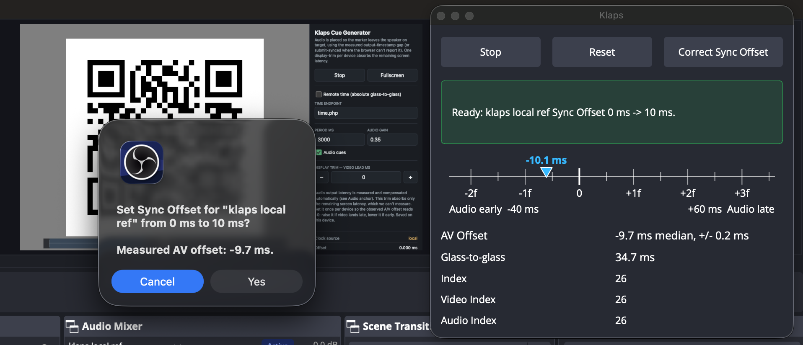

# Klaps for OBS Studio

## Introduction

Klaps is an OBS Studio plugin that measures audio offset and video latency. 

The Polish word _"klaps"_ has a dual meaning - it's either a spank or 
a film clapperboard. In combat conditions both can be used to measure AV 
synchronization i guess... ;)

The software is based on solid grounds of Norihiro's [Audio Video Sync Dock](https://obsproject.com/forum/resources/audio-video-sync-dock.2028/). 

The ideas for improvements are mine, the programming work has been done by Codex.

## Motivation behind the fork

The AV offset workflow provides repeatable relative AV sync checks through real
displays, speakers, cameras, microphones, OBS media and browser sources, and
recordings. Its key properties are:
- lower-flash video markers,
- extended QR Code vocabulary allowing glass-to-glass latency  measurements,
- new visual markers for naked-eye AV offset assessment (web generator-only),
- cleaner event timing,
- sample-centered chirp/tick audio detection designed for echo and reverberation tolerance,
- DTMF/CRC event identity,
- MOV reference assets that avoid AAC priming and B-frame reorder bias.

The redesigned protocol separates timing from identity: sparse checkerboard 
transitions define the video instant, a matched-filter chirp/tick defines the 
audio fiducial, and the later DTMF/CRC payload only pairs the correct events. 
It remains visually unobtrusive while measuring relative AV offset rather than 
true source-to-capture latency.

OBS Studio 31 or newer is required. The dock analyzes the main Program video
and audio Track 1 through a private pair of no-op OBS encoders. These encoders
run alongside streaming and recording outputs, but do not compress or write
media. Using OBS encoder PTS and compositor CTS keeps the measurement on the
actual mixed output timeline instead of trusting timestamps supplied by an
individual source.

The original implementation gathered raw Program buffers along the path
`sources -> Program composition/audio mix -> raw output callbacks -> detector`.
Although this provided the mixed audio and video, their timestamps could still
reflect upstream source scheduling because the buffers did not pass through
OBS's encoder start-pairing and timestamp-correction path. The current approach
instead follows `sources -> Program composition/audio mix -> paired analyzer
encoders -> detector`: OBS aligns audio Track 1 with the first Program video
frame and gives both streams a common, zero-based PTS timeline. The detector
uses those frame and sample PTS values for relative A/V offset, while the video
composition timestamp (CTS) is mapped to the system clock only for end-to-end
latency. The analyzer emits and immediately discards one-byte packets, so it
uses OBS's "encoded" signal flow without compressing or writing any media.

## Asynchronous sources and repeatable measurements

The dock measures the Program output, so a stable but unexpected result can
also be a real timing state created by OBS rather than an error in the probe.
This matters most for coupled asynchronous audio/video sources such as **Media
Source** (and potentially VLC or some capture-device sources). In OBS 32.1.2,
audio may arrive and establish the source timing mapping before the first
asynchronous video frame is rendered. When that first video frame arrives,
libobs replaces the mapping with a video-derived one. Audio already buffered
under the earlier mapping can remain there because OBS smooths small timestamp
changes (up to 70 ms) instead of moving the audio queue.

As a result, two cold starts of the same async source can land on different
baselines if their initial audio/video scheduling differs. A particularly
confusing case is changing a source's **Audio Sync Offset** from `0 ms` to a
nonzero value and back to `0 ms` while it is playing: in OBS 32.1.2 that can
re-anchor the queued audio and leave a persistent step in the Program A/V
measurement even though the final configured offset is zero. This is a libobs
async-source startup/queue behavior, not evidence that Media Source changed
the file's A/V timestamps or that the Klaps is incorrectly reading the timestamps.

### AJA and DeckLink capture sources

In OBS 32.1.2, this behavior also applies to **AJA** and **DeckLink** capture
sources when their **Buffering** option is enabled. AJA enables buffering by
default; DeckLink does not. In that mode, both sources use the buffered
asynchronous-video path, where audio can be queued before the first rendered
video frame establishes the video-derived timing mapping. Disabling Buffering
makes these sources asynchronous-unbuffered and decoupled, which skips this
particular timing-anchor overwrite. That changes capture latency and frame-drop
behavior, so use it only as a deliberate test configuration, not as a general
sync correction.

For consistent results:

1. Use the generated PCM, intra-only MOV reference asset when testing the
   measurement path; it avoids intentional AAC priming and B-frame reorder
   biases.
2. Set all source sync offsets before starting the test. Do not nudge a
   coupled async source's Audio Sync Offset during a run, even if you return it
   to the original value.
3. After changing an async source's offset, restarting, seeking, reactivating,
   or replacing it, treat the resulting measurement as a new run. Do not
   compare it directly with a baseline collected before that transition.
4. Make several fresh runs with unchanged OBS frame rate, audio sample rate,
   buffering, source settings, and capture path. Use the stable cluster of
   readings as the baseline; investigate a run that forms a separate stable
   cluster instead of averaging both states together.
5. For an OBS behavior change, confirm the result against a Program recording
   made with the same source offsets and output settings. This distinguishes
   source-startup behavior from room acoustics, camera/display cadence, and
   other capture-path variation.

The general OBS-side remedy is to discard audio buffered before the first
async-video timing anchor, then place subsequent audio using the video-derived
mapping. Until that is available in libobs, the clean startup workflow above is 
the reliable way to compare async-source results.

## Installing an unsigned build on macOS

The current macOS release artifacts are not signed with an Apple Developer ID
or notarized. macOS may therefore block the PKG installer or prevent OBS from
loading the plugin. Only override this protection for an artifact downloaded
from this project's [official GitHub Releases page](https://github.com/matiaspl/klaps/releases)
that you trust.

First try the PKG once. If macOS reports that the developer cannot be verified
or that Apple cannot check it for malicious software, open **System Settings >
Privacy & Security**, scroll to **Security**, and use **Open Anyway**. The
button is normally available for about an hour after the blocked attempt; see
[Apple's instructions](https://support.apple.com/guide/mac-help/mh40617/mac)
for the current macOS procedure.

If the PKG remains blocked, install the ZIP manually:

1. Quit OBS completely. A running OBS process keeps the old plugin binary
   loaded.
2. Download the macOS ZIP matching the installed OBS major version, then
   double-click it to unpack `klaps.plugin`.
3. In Finder, choose **Go > Go to Folder** and enter
   `~/Library/Application Support/obs-studio/plugins`.
4. If upgrading, remove old `obs-avs.plugin` or
   `obs-audio-video-sync-dock.plugin` bundles first so OBS does not load both
   copies. Check the user path above and
   `/Library/Application Support/obs-studio/plugins` for legacy bundles.
5. Create the `plugins` folder if it does not exist, then copy
   `klaps.plugin` into it. Replace the existing bundle when
   upgrading.
6. Start OBS again.

The same copy can be performed in Terminal after unpacking the ZIP in
`~/Downloads`:

```sh
PLUGIN="$HOME/Library/Application Support/obs-studio/plugins/klaps.plugin"
mkdir -p "$HOME/Library/Application Support/obs-studio/plugins"
ditto "$HOME/Downloads/klaps.plugin" "$PLUGIN"
```

If OBS still cannot load the plugin and the downloaded bundle has a quarantine
attribute, remove only that attribute from this plugin bundle, then restart
OBS:

```sh
PLUGIN="$HOME/Library/Application Support/obs-studio/plugins/klaps.plugin"
xattr -lr "$PLUGIN"
xattr -dr com.apple.quarantine "$PLUGIN"
```

Removing quarantine bypasses a macOS security check. Do not run this for a
bundle obtained from another source, do not clear attributes globally, and do
not disable Gatekeeper. If macOS says the plugin **will damage your computer**,
delete the download instead of overriding the warning.

## How to use

Use the MOV clip workflow when you only need relative audio/video offset
inside a repeatable file-based test. 
When you need the full display-to-camera-to-OBS path latency use the web generator workflow.



The analyzer always follows the main Program canvas and audio Track 1. Note, 
that the analysis needs to be stopped in order to change the canvas framerate 
or resolution.

Klaps displays AV offset to `0.1 ms`, but that is readout resolution, not a
claim that every capture path is accurate to one tenth of a millisecond; use
the reported median and jitter and look for repeatable results. As a practical
limit, [EBU Recommendation R37-2007](https://tech.ebu.ch/publications/r037)
specifies that sound should be no more than `40 ms` early or `60 ms` late, the
same range shown by the ruler. Perception varies with content and the viewer,
and [ITU-R BT.1359](https://www.itu.int/rec/R-REC-BT.1359-1-199811-I/en)
reports asymmetric average thresholds: sound arriving before the matching
picture is generally noticed sooner, especially with speech or sharp visible
and audible events. Aim near zero rather than treating the ruler limits as
targets.

### Web generator workflow

For live source-to-capture latency tests, open the web-based Klaps Cue Generator:

<[https://matiaspl.github.io/klaps/](https://matiaspl.github.io/klaps/)>

The web generator renders the same v2 visual marker sequence in the browser and
schedules matching acoustic packets against a shared wall-clock target time. Its
QR payload includes the target UTC timestamp, so apart from the the AV offset the dock 
can compare that source time with the capture timestamp and report `Glass-to-glass` latency. 
This is especially useful for measuring the latency of a capture-encode-decode chain.

### AV offset clip workflow

Use this workflow when you want to measure the relative offset between audio and
video after playing a test clip through an external device, capturing it back
with a camera and microphone.

1. Generate a low-flash AV offset clip:

   ```sh
   (cd tool && ./avoffsetgen.py --vr 30 --ar 48000 -o /tmp/av-offset-pattern.mp4)
   ```

   Or use one of the generated MOV files:

   | MOV file | Video frame rate | Supported display frame rate |
   | -------- | ----------------:| ---------------------------- |
   | [av-offset-pattern-6000.mov](https://matiaspl.github.io/klaps/av-offset-pattern-6000.mov) | 60 FPS | 30 FPS, 60 FPS, or 120 FPS (iPhone) |
   | [av-offset-pattern-5994.mov](https://matiaspl.github.io/klaps/av-offset-pattern-5994.mov) | 59.94 FPS | 29.97 FPS, 59.94 FPS, or 119.88 FPS |
   | [av-offset-pattern-5000.mov](https://matiaspl.github.io/klaps/av-offset-pattern-5000.mov) | 50 FPS | 25 FPS or 50 FPS (PAL) |
   | [av-offset-pattern-3000.mov](https://matiaspl.github.io/klaps/av-offset-pattern-3000.mov) | 30 FPS | 30 FPS or 60 FPS |
   | [av-offset-pattern-2997.mov](https://matiaspl.github.io/klaps/av-offset-pattern-2997.mov) | 29.97 FPS | 29.97 FPS or 59.94 FPS |
   | [av-offset-pattern-2400.mov](https://matiaspl.github.io/klaps/av-offset-pattern-2400.mov) | 24 FPS | 24 FPS or 48 FPS |
   | [av-offset-pattern-2398.mov](https://matiaspl.github.io/klaps/av-offset-pattern-2398.mov) | 23.98 FPS | 23.98 FPS (24 FPS NTSC) |

   The generated MOV files are the preferred reference assets. They use PCM s16
   mono audio and intra-only H.264 video without B-frames, so the timing markers
   are not shifted by AAC encoder priming or video frame reordering. MP4 files
   with AAC audio are easier to play in some environments, but the lossy audio
   path can add a fixed priming bias and normal H.264 GOPs can add reorder
   latency; use those only when you intentionally want to measure that playback
   or codec behavior.

2. Play the generated clip on the device under test.
3. Capture the device with the camera and microphone that OBS will use.
4. Open the Klaps dock and start measuring.

### Correcting a source's Sync Offset

**Correct Sync Offset** turns the current Program measurement into an OBS Sync
Offset adjustment for the audio source. It aims for a measured A/V offset of
zero and uses:

```text
new Sync Offset = current Sync Offset - measured AV Offset
```

For example, if the dock reports `+120 ms` (**Audio lagged**) and the source is
currently at `0 ms`, the proposed Sync Offset is `-120 ms`. If it reports
`-80 ms` (**Audio early**), the proposed value is `+80 ms`. The confirmation
dialog shows the source, current value, proposed value, and measurement before
anything is changed. Confirming updates that source's OBS Sync Offset and saves
the OBS configuration; it does not modify the test media or add a filter.

Automatic correction is available only when OBS has exactly one active audio
source routed to Track 1. With several active sources, the dock can measure the
Program mix but cannot determine which source is responsible for the offset, so
it will not change any of them. To correct one source, isolate it for the test:
deactivate the other audio sources or route them away from Track 1, while
leaving the source under test and its video visible on Program.

The button becomes available after at least three consistent measurements and
only while the latest measurement is less than 10 seconds old. It is disabled
if a Program transition is active, the scene or active Track 1 source set has
changed, the source's Sync Offset has changed since measurement, the source
cannot be identified safely, or the proposed value is outside OBS's supported
`-950 ms` to `20000 ms` range. The status below the button explains which
condition is not satisfied.

Use the correction only for a stable, repeatable offset in the path you intend
to operate. Keep the same source, routing, frame rate, sample rate, buffering,
and capture path while measuring. After applying it, the dock clears the old
samples; wait for a new stable result and verify it, preferably in a Program
recording. Do not use a single noisy reading to compensate room reflections,
variable wireless or network delay, or a source that will be used later with a
different capture path.

For coupled asynchronous sources such as Media Source, or buffered AJA and
DeckLink sources, changing Sync Offset can itself re-anchor audio in affected
OBS versions. Treat the correction as the end of the old run: restart or
reactivate the source if appropriate, collect a fresh set of readings, and
verify the resulting Program output as described in
[Asynchronous sources and repeatable measurements](#asynchronous-sources-and-repeatable-measurements).

To verify the reference file itself without OBS media-source scheduling in the
path, run:

```sh
(cd tool && ./verify_avoffset_file.py ../release/av-offset-pattern-media-source.mov)
```

When validating OBS behavior, compare the dock result against an actual OBS
recording made with the same source sync offsets, encoder, frame rate, and audio
buffering settings.

## Science behind the V2 pattern

The v2 pattern uses sparse checkerboard events for video timing and far-field
acoustic packets for audio timing and identity. The exact audio event is the
center of the packet's short tick inside the centered matched-filter marker.
The QR code stores its metadata as a compact comma-separated ASCII list of
single-letter key/value pairs, for example `p=2,s=17,q=100,i=17,m=1`.
`p` selects protocol version 2, `q` gives the checker phase duration in
milliseconds, and `s` and `i` carry the 8-bit event identity that is matched to
the audio packet. The live web generator also adds `n`, the target UTC time in
Unix milliseconds, which lets the analyzer calculate glass-to-glass latency;
pre-recorded patterns omit it because their playback time is not known in
advance. The visual payload uses standard level-M QR error correction, while
unknown or reserved fields are ignored for compatibility. DTMF uses the
standard 4x3 keypad frequencies, the same 8-bit event code, CRC8, and 60 ms
symbol guards for identity. The measurement is relative AV offset only;
without a live timestamp it does not claim true source-to-capture transmission
latency.

The audio packet is designed to be more tolerant of echo and reverberation than
a single short tone burst or quadrature amplitude modulation in the audible 
audio spectrum range. The timing fiducial is an 80 ms up/down chirp with a
short Ricker/Mexican-hat-style tick at the center, and the analyzer finds it by
matched-filter correlation; this is the same general signal-processing family
used for delay estimation of known waveforms in noisy and multipath channels.
The DTMF section is deliberately after the timing marker and guard interval, so
it identifies the event without defining the event time. DTMF also uses the
well-established two-frequency voice-band code standardized for push-button
signalling by ITU-T Q.23/Q.24, where receiver design explicitly considers
speech simulation, echoes, and noise immunity. This should be read as a
robustness design, not a guarantee: strong unresolved early reflections can
still bias any acoustic time-of-arrival measurement, so difficult rooms should
be validated with repeat runs and microphone placement changes.

Related background: [A random stackexchange post](https://dsp.stackexchange.com/a/71785), [matched-filter delay estimation](https://arxiv.org/abs/1101.2713),
[multipath delay-estimation bias](https://arxiv.org/abs/2012.05790),
[ITU-T Q.23](https://www.itu.int/rec/T-REC-Q.23/en), and
[ITU-T Q.24](https://www.itu.int/rec/T-REC-Q.24/en).
